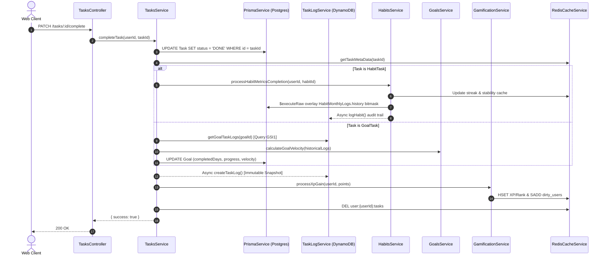
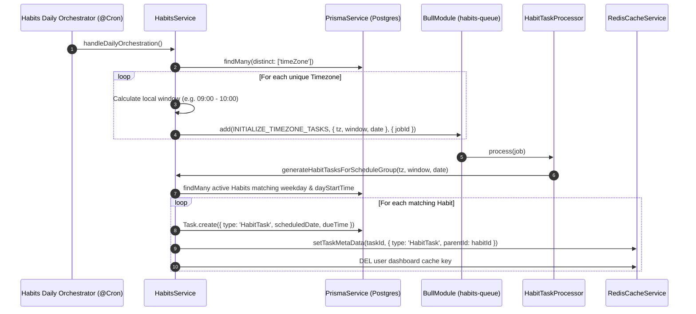

# Day Mark Backend Architecture Guide (C4 Level 3 Component View)

This document provides a comprehensive, production-grade architectural analysis of the `apps/backend` container (NestJS 11) within the **Day Mark (Ascend)** monorepo. It details internal component boundaries, control flows, background scheduling, multi-database persistence semantics, and asynchronous pipelines.

---

## 1. System Overview & Core Design Principles

The backend is engineered as a high-throughput, timezone-aware discipline engine and execution ledger. Rather than treating all entities uniformly, the system segregates workloads across purpose-fit persistence engines:

* **Relational Core (PostgreSQL + Prisma):** Enforces relational integrity, foreign key cascades, and unique constraints for users, accounts, goals, habits, and tasks.
* **Append-Only Event Ledger (AWS DynamoDB):** Stores immutable execution logs, single-table daily reflection records, and completion snapshots with GSI indexes.
* **Real-time Notification Inbox (MongoDB + Mongoose):** Serves ephemeral, high-churn in-app notifications with automatic 30-day TTL indexing and immediate deletion upon client ACK.
* **Low-Latency Cache & Distributed Lock Store (Upstash Redis):** Manages core user profiles, 7-day refresh tokens, high-frequency activity heartbeats, and Redlock-coordinated distributed write-behind operations.
* **Asynchronous Queue & Pub/Sub Bus (Queue Redis):** Backs BullMQ job streams (`habits-queue`, `notification-queue`) and the multi-replica Socket.IO Redis adapter.

---

## 2. C4 Level 3 Component Diagram (`apps/backend`)

The following diagram illustrates all internal NestJS modules, controllers, guards, domain services, background processors, infrastructure adapters, and external database systems.

```mermaid
flowchart TD

    %% =========================================================================
    %% SUBGRAPH 1: ENTRY & CONTROL LAYER
    %% =========================================================================
    subgraph EntryLayer ["1. Entry & Control Layer (Controllers, Guards & Gateway)"]
        ValidationPipe["ValidationPipe<br/><i>(Global DTO Validation & Whitelisting)</i>"]
        AuthGuard["AuthGuard & Passport Strategies<br/><i>(JWT Verification & Google/GitHub OAuth)</i>"]
        
        AuthCtrl["AuthController<br/><i>(/auth - Login, Signup, Refresh, Reset, OAuth)</i>"]
        UserCtrl["UserController<br/><i>(/user - Profile, Timezone, Activity, Reflection)</i>"]
        TasksCtrl["TasksController<br/><i>(/tasks - Task CRUD, Dashboard, Reschedule)</i>"]
        HabitsCtrl["HabitsController<br/><i>(/habits - CRUD, Toggle, Heatmap Logs)</i>"]
        GoalsCtrl["GoalsController<br/><i>(/goals - Blueprints, Sprints, Planning)</i>"]
        NotificationCtrl["NotificationController<br/><i>(/notifications - Prefs, WebPush Subscriptions)</i>"]
        HealthCtrl["HealthController<br/><i>(/health - Liveness & Compute Warmup)</i>"]
        
        NotificationGateway["NotificationGateway<br/><i>(Socket.IO WebSocket Server & ACK Sweeper)</i>"]
    end

    %% =========================================================================
    %% SUBGRAPH 2: DOMAIN & APPLICATION SERVICES
    %% =========================================================================
    subgraph DomainServices ["2. Domain & Application Services"]
        AuthSvc["AuthService<br/><i>(Credentials, Token Issuance, Password Reset)</i>"]
        AuthCacheRepo["AuthCacheRepository<br/><i>(Refresh Token Key Management)</i>"]
        
        UserSvc["UserService<br/><i>(Identity Lifecycle, Accounts & Profile Resolution)</i>"]
        UserCacheRepo["UserCacheRepository<br/><i>(Core Profile Cache Layer)</i>"]
        SelfReflectionSvc["SelfReflectionService<br/><i>(Daily Reflection Logging & Task Planning)</i>"]
        UserActivitySvc["UserActivityService<br/><i>(Fast In-Memory Heartbeat Collector)</i>"]
        
        TasksSvc["TasksService<br/><i>(Task Orchestration, Completion & XP Triggers)</i>"]
        TasksCacheRepo["TasksCacheRepository<br/><i>(Task Routing Metadata Cache)</i>"]
        
        HabitsSvc["HabitsService<br/><i>(Habit Orchestration, Streaks & Stability Score)</i>"]
        HabitsCacheRepo["HabitsCacheRepository<br/><i>(Streak & Stability Cache Store)</i>"]
        
        GoalsSvc["GoalsService<br/><i>(Goal Progress & Velocity Calculator)</i>"]
        
        NotificationSvc["NotificationService<br/><i>(Multi-Channel Dispatcher & Policy Enforcer)</i>"]
        InAppProv["InAppProvider<br/><i>(MongoDB Persistence & Socket Dispatch)</i>"]
        WebPushProv["WebPushProvider<br/><i>(VAPID Web Push Payload Deliverer)</i>"]
        
        GamificationSvc["GamificationService<br/><i>(XP Progress Math & Distributed Write-Behind)</i>"]
        GamificationCacheRepo["GamificationCacheRepository<br/><i>(Dirty Set & Rank State Cache)</i>"]
        
        HealthSvc["HealthService<br/><i>(Database Pool Warmup Engine)</i>"]
    end

    %% =========================================================================
    %% SUBGRAPH 3: BACKGROUND PROCESSING & SCHEDULERS
    %% =========================================================================
    subgraph BackgroundProcessing ["3. Background Processing & Schedulers (BullMQ & Crons)"]
        NotificationCron["NotificationCron<br/><i>(@Cron EVERY_HOUR: Enqueues Dynamic Reminders)</i>"]
        HabitsCron["Habits Daily Orchestrator<br/><i>(@Cron 0 * * * *: Timezone Window Enqueue)</i>"]
        UserActivityCron["UserActivitySyncCron<br/><i>(@Cron EVERY_HOUR: LastActive Batch Sync)</i>"]
        GamificationCron["GamificationSyncCron<br/><i>(@Cron EVERY_10_SECONDS: Redis-to-DB Flush)</i>"]
        HealthCron["HealthCron<br/><i>(@Cron */4 * * * *: DB Keep-Alive Heartbeat)</i>"]
        
        HabitTaskProcessor["HabitTaskProcessor<br/><i>(BullMQ Worker: habits-queue)</i>"]
        NotificationProcessor["NotificationProcessor<br/><i>(BullMQ Worker: notification-queue)</i>"]
    end

    %% =========================================================================
    %% SUBGRAPH 4: SHARED INFRASTRUCTURE ADAPTERS
    %% =========================================================================
    subgraph InfrastructureAdapters ["4. Shared Infrastructure Adapters (src/common)"]
        PrismaSvc["PrismaService<br/><i>(PostgreSQL Client & Transaction Manager)</i>"]
        RedisCacheSvc["RedisCacheService<br/><i>(Upstash Redis Client & Redlock Distributed Locks)</i>"]
        DynamoDbSvc["DynamoDbService<br/><i>(AWS DynamoDB Document Client)</i>"]
        TaskLogSvc["TaskLogService<br/><i>(Immutable Task Completion Logs & GSI1/2 Queries)</i>"]
        HabitLogSvc["HabitLogService<br/><i>(Single-Table Habit Audit Ledger Logs)</i>"]
        MongoDbMod["MongoDatabaseModule / Mongoose<br/><i>(Mongoose AppNotification Document Model)</i>"]
        RedisIOAdapter["RedisIOAdapter<br/><i>(Socket.IO Redis Pub/Sub Multi-Pod Adapter)</i>"]
        BullQueueMod["BullModule / LocalRedisModule<br/><i>(BullMQ Queue Driver & Redis Connection)</i>"]
    end

    %% =========================================================================
    %% SUBGRAPH 5: EXTERNAL INFRASTRUCTURE TARGETS
    %% =========================================================================
    subgraph ExternalTargets ["5. External Infrastructure & Persistence Targets"]
        PostgresDB[("PostgreSQL Database<br/><i>(Users, Accounts, Tasks, Habits, Goals, MonthlyLogs, XP)</i>")]
        UpstashRedisDB[("Upstash Redis<br/><i>(Core Profiles, Refresh Tokens, Gamification Hashes, Redlock)</i>")]
        QueueRedisDB[("Queue Redis<br/><i>(BullMQ Queues & Socket.IO Pub/Sub Bus)</i>")]
        DynamoDBTable[("AWS DynamoDB Table<br/><i>('Day-Mark-Logs' Table with GSI1 & GSI2)</i>")]
        MongoDBCluster[("MongoDB Cluster<br/><i>(In-App Notification Inbox with 30-Day TTL Index)</i>")]
    end

    %% =========================================================================
    %% PIPELINE & ENTRY LEVEL ROUTING
    %% =========================================================================
    ValidationPipe -- "Validates & Sanitizes DTOs" --> AuthCtrl
    ValidationPipe -- "Validates & Sanitizes DTOs" --> UserCtrl
    ValidationPipe -- "Validates & Sanitizes DTOs" --> TasksCtrl
    ValidationPipe -- "Validates & Sanitizes DTOs" --> HabitsCtrl
    ValidationPipe -- "Validates & Sanitizes DTOs" --> GoalsCtrl
    ValidationPipe -- "Validates & Sanitizes DTOs" --> NotificationCtrl

    AuthGuard -- "Protects Route & Attaches User ID" --> UserCtrl
    AuthGuard -- "Protects Route & Attaches User ID" --> TasksCtrl
    AuthGuard -- "Protects Route & Attaches User ID" --> HabitsCtrl
    AuthGuard -- "Protects Route & Attaches User ID" --> GoalsCtrl

    %% =========================================================================
    %% CONTROLLER TO SERVICE INTERACTIONS
    %% =========================================================================
    AuthCtrl -- "Validates & Rotates Session" --> AuthSvc
    AuthCtrl -- "Creates Profile & Accounts (Tx)" --> UserSvc
    AuthCtrl -- "Runs Sign-Up Transaction" --> PrismaSvc

    UserCtrl -- "Fetches / Updates User Matrix" --> UserSvc
    UserCtrl -- "Submits Daily Reflection" --> SelfReflectionSvc
    UserCtrl -- "Fast In-Memory Heartbeat Ping" --> UserActivitySvc

    TasksCtrl -- "Delegates CRUD & Actions" --> TasksSvc

    HabitsCtrl -- "Delegates CRUD & Analytics" --> HabitsSvc

    GoalsCtrl -- "Delegates Goal Orchestration" --> GoalsSvc
    GoalsCtrl -- "Queries Workspace Goal Logs" --> TaskLogSvc

    NotificationCtrl -- "Updates Preferences & WebPush Keys" --> NotificationSvc
    HealthCtrl -- "Initiates Connection Warmup" --> HealthSvc

    %% =========================================================================
    %% AUTH & USER DOMAIN INTERACTIONS
    %% =========================================================================
    AuthSvc -- "Finds User & Account Credentials" --> UserSvc
    AuthSvc -- "Stores Password Reset Token (TTL 5m)" --> RedisCacheSvc
    AuthSvc -- "Manages Refresh Token Key Store" --> AuthCacheRepo
    AuthCacheRepo -- "Caches Token Hash (TTL 7d)" --> RedisCacheSvc

    UserSvc -- "Reads / Writes User Profile & Accounts" --> PrismaSvc
    UserSvc -- "Caches Core Profile (Write-Through)" --> UserCacheRepo
    UserSvc -- "Queries Gamification State" --> GamificationCacheRepo
    UserSvc -- "Verifies Existing Daily Reflection" --> DynamoDbSvc
    UserCacheRepo -- "Stores Profile JSON" --> RedisCacheSvc

    UserActivitySvc -- "HSET user:last_active Timestamp" --> RedisCacheSvc
    UserActivitySvc -- "Batch Updates User.lastActive" --> PrismaSvc
    UserActivityCron -- "Triggers Hourly Activity Sync" --> UserActivitySvc

    SelfReflectionSvc -- "Persists Reflection Item" --> DynamoDbSvc
    SelfReflectionSvc -- "Spawns Tomorrow Tasks" --> TasksSvc

    %% =========================================================================
    %% TASK, HABIT & GOAL DOMAIN INTERACTIONS
    %% =========================================================================
    TasksSvc -- "Task State Mutation (PENDING/DONE)" --> PrismaSvc
    TasksSvc -- "Caches Dashboard & User Task Lists" --> RedisCacheSvc
    TasksSvc -- "Caches Routing Parent Metadata" --> TasksCacheRepo
    TasksCacheRepo -- "Sets Task Type / ParentId (TTL 24h)" --> RedisCacheSvc
    TasksSvc -- "Triggers XP Gain Math" --> GamificationSvc
    TasksSvc -- "Appends Async Task Audit Trail" --> TaskLogSvc
    TasksSvc -- "Updates Habit Completion Metrics" --> HabitsSvc
    TasksSvc -- "Updates Goal Completion & Velocity" --> GoalsSvc
    TaskLogSvc -- "Writes Task Log & GSI Indexes" --> DynamoDbSvc

    HabitsSvc -- "CRUD & Monthly History Bitmask Overlay" --> PrismaSvc
    HabitsSvc -- "Caches Streaks & Stability Metrics" --> HabitsCacheRepo
    HabitsCacheRepo -- "HSET Habit Streaks & Scores" --> RedisCacheSvc
    HabitsSvc -- "Enqueues Timezone Windows" --> BullQueueMod
    HabitsSvc -- "Appends Habit Execution Checkpoint" --> HabitLogSvc
    HabitLogSvc -- "Writes Habit Log Ledger" --> DynamoDbSvc
    HabitsCron -- "Fires Timezone Window Evaluation" --> HabitsSvc
    HabitTaskProcessor -- "Processes Window Batch Job" --> HabitsSvc
    HabitTaskProcessor -- "Consumes habits-queue" --> BullQueueMod

    GoalsSvc -- "Transactional Blueprint Setup" --> PrismaSvc
    GoalsSvc -- "Creates Initial Goal Task" --> TasksSvc
    GoalsSvc -- "Queries Historic Logs for Velocity" --> TaskLogSvc

    %% =========================================================================
    %% NOTIFICATION DOMAIN & REALTIME INTERACTIONS
    %% =========================================================================
    NotificationSvc -- "Upserts Prefs & Push Subscriptions" --> PrismaSvc
    NotificationSvc -- "Caches Notification Prefs (TTL 24h)" --> RedisCacheSvc
    NotificationSvc -- "Fetches Unread Offline Notifications" --> MongoDbMod
    NotificationSvc -- "Dispatches to In-App Channel" --> InAppProv
    NotificationSvc -- "Dispatches to Web Push Channel" --> WebPushProv

    InAppProv -- "Persists Notification Document" --> MongoDbMod
    InAppProv -- "Broadcasts Realtime Notification" --> NotificationGateway
    WebPushProv -- "Fetches User Push Subscriptions" --> PrismaSvc

    NotificationGateway -- "Redis Pub/Sub Broadcast Adapter" --> RedisIOAdapter
    NotificationGateway -- "Deletes ACK'd Notification Item" --> MongoDbMod

    NotificationCron -- "Queries Users for Dynamic Schedule" --> PrismaSvc
    NotificationCron -- "Enqueues Notification Jobs" --> BullQueueMod
    NotificationProcessor -- "Consumes notification-queue" --> BullQueueMod
    NotificationProcessor -- "Dispatches Web Push Alert" --> WebPushProv

    %% =========================================================================
    %% GAMIFICATION & HEALTH INTERACTIONS
    %% =========================================================================
    GamificationSvc -- "Reads / Updates Active Rank & XP" --> GamificationCacheRepo
    GamificationCacheRepo -- "HSET XP/Level & SADD Dirty Set" --> RedisCacheSvc
    GamificationCron -- "Triggers Write-Behind Sync" --> GamificationSvc
    GamificationSvc -- "Acquires Redlock Lock ('locks:user-db-sync')" --> RedisCacheSvc
    GamificationSvc -- "Batch Flushes User XP & XpTransactions" --> PrismaSvc

    HealthSvc -- "Executes SELECT 1 Compute Ping" --> PrismaSvc
    HealthCron -- "Triggers Periodic Warmup Heartbeat" --> HealthSvc

    %% =========================================================================
    %% INFRASTRUCTURE ADAPTERS TO PERSISTENCE TARGETS
    %% =========================================================================
    PrismaSvc -- "TCP Connection Pool / SQL Transactions" --> PostgresDB
    RedisCacheSvc -- "RESP Protocol (Strings, Hashes, Sets, Redlock)" --> UpstashRedisDB
    BullQueueMod -- "BullMQ Queue Engine & Streams" --> QueueRedisDB
    RedisIOAdapter -- "Socket.IO Multi-Pod Cluster Sync" --> QueueRedisDB
    DynamoDbSvc -- "AWS SDK Document Client (Put/Query/Delete)" --> DynamoDBTable
    MongoDbMod -- "Mongoose Driver (BSON / TTL Indexes)" --> MongoDBCluster
```

---

## 3. Layer Breakdown & Component Responsibilities

### 3.1 Entry & Control Layer

1. **Global Pipeline (`main.ts`):**
   * **`ValidationPipe`:** Enforces strict DTO contracts with `whitelist: true` and `forbidNonWhitelisted: true`.
   * **Cookie Parser:** Populates incoming `req.cookies` for HTTP-only token extraction.
   * **CORS & WebSocket Adapter:** Binds `RedisIOAdapter` to Socket.IO for multi-instance pub/sub synchronisation.
2. **`AuthGuard` (`src/common/gaurds/auth.gaurds.ts`):**
   * Inspects `req.cookies.access_token`.
   * Cryptographically verifies the payload using `env.JWT_ACCESS_SECRET`.
   * Injects `{ userId: decoded.userId }` into `AuthenticatedRequest`.
3. **`NotificationGateway` (`gateways/notification.gateway.ts`):**
   * Manages client socket connections and assigns them to `user:${userId}` rooms.
   * Emits `NEW_NOTIFICATION` payloads dispatched from `InAppProvider`.
   * Listens for `ACK_NOTIFICATION` messages and executes **The Sweep**—deleting the acknowledged notification document from MongoDB to keep user offline fetches compact.

---

### 3.2 Domain Services & Repositories

| Component | Responsibility | Persistence / Cache Target |
| :--- | :--- | :--- |
| **`AuthService`** | Credential validation, token issuance (`access_token` 15m, `refresh_token` 7d), OAuth linking, password reset orchestration via Resend. | Upstash Redis (`refresh:{userId}`, `password-reset:{token}`), PostgreSQL |
| **`UserService`** | Core profile aggregation, write-through caching, timezone updates, onboarding completion. | PostgreSQL (`User`, `Account`), Upstash Redis (`user:{userId}:core_profile`) |
| **`UserActivityService`** | Fast in-memory activity tracking (`<2ms`), recording ISO timestamps to a Redis Hash. | Upstash Redis (`user:last_active`), PostgreSQL (hourly batch sync) |
| **`SelfReflectionService`** | Computes logical user dates (`dayStartTime` + `timeZone`), ensures once-per-day submission limits, logs reflection items, and generates tomorrow's tasks. | DynamoDB (`USER#{userId}`, `REFLECTION#{YYYY-MM-DD}`), PostgreSQL (`Task`) |
| **`TasksService`** | Task CRUD, date boundary partitioning (today vs abandoned), task completion side effects, metadata caching, XP reward triggers. | PostgreSQL (`Task`), Upstash Redis (`user:{userId}:tasks`, `task:meta:{taskId}`) |
| **`HabitsService`** | Habit creation, active timezone grouping, month history bitmask flips (`S`/`D`), streak and stability calculations. | PostgreSQL (`Habit`, `HabitMonthlyLogs`), Upstash Redis (`habit:{userId}:{habitId}:meta`) |
| **`GoalsService`** | Goal blueprints, sprint calculation, completion target calculation, progress and velocity formulas. | PostgreSQL (`Goal`), DynamoDB (via `TaskLogService`) |
| **`NotificationService`** | Channel provider registry (`IN_APP`, `WEB_PUSH`), user preference caching, dynamic payload generation from template registries. | Upstash Redis (`user:{userId}:notification_prefs`), PostgreSQL (`NotificationPreference`, `PushSubscription`) |
| **`GamificationService`** | Pure mathematical XP calculator (`calculateXpProgression`), rank progression, and distributed write-behind batching. | Upstash Redis (Hashes & Dirty Sets), PostgreSQL (`User.xp`, `XpTransaction`) |
| **`HealthService`** | Database connection warming and liveness checks (`SELECT 1`). | PostgreSQL (`$queryRaw`) |

---

### 3.3 Background Processing & Scheduling

The system employs both cron-based heartbeat triggers and distributed BullMQ workers:

1. **`HabitsCron` (`0 * * * *`):**
   * Queries distinct user timezones from PostgreSQL.
   * Calculates local hour windows (`windowStartMinutes` to `windowEndMinutes`).
   * Enqueues `HABIT_JOBS.INITIALIZE_TIMEZONE_TASKS` into `habits-queue` with idempotent job IDs (`init_window:{tz}-H{hh}:{date}`).
2. **`HabitTaskProcessor` (`habits-queue` Worker):**
   * Consumes timezone window jobs from BullMQ.
   * Calls `HabitsService.generateHabitTasksForScheduleGroup()`.
   * Batches `HabitTask` creation in PostgreSQL and invalidates user task caches.
3. **`NotificationCron` (`@Cron(CronExpression.EVERY_HOUR)`):**
   * Evaluates user `dayStartTime` configurations.
   * Calculates delays for Start-Day (baseline), Mid-Day (+6h), and End-Day (+12h) reminders.
   * Enqueues dynamic `send-notification` jobs into `notification-queue` with strict date-stamp deduplication keys.
4. **`NotificationProcessor` (`notification-queue` Worker):**
   * Consumes queued reminder jobs.
   * Resolves notification template payloads.
   * Dispatches desktop push alerts via `WebPushProvider`.
5. **`GamificationSyncCron` (`@Cron(CronExpression.EVERY_10_SECONDS)`):**
   * Implements a **Write-Behind Cache Engine**.
   * Acquires a distributed lock (`locks:user-db-sync`) via Redlock (8000ms TTL).
   * Reads the `dirty_users` Set from Redis.
   * Reads updated XP/Level hashes and commits bulk updates + `XpTransaction` audit records to PostgreSQL in a single `$transaction`.
   * Evicts flushed users from the dirty set and releases the Redlock lock.
6. **`UserActivityCron` (`@Cron(CronExpression.EVERY_HOUR)`):**
   * Reads all pending user activity timestamps from the `user:last_active` Redis Hash.
   * Executes a bulk `$transaction` update to sync `User.lastActive` in PostgreSQL.
   * Pipelined `HDEL` operations remove synced keys from Redis.
7. **`HealthCron` (`@Cron('*/4 * * * *')`):**
   * Sends raw `SELECT 1` queries to PostgreSQL to prevent serverless compute pools from entering cold sleep.

---

### 3.4 Shared Infrastructure Adapters (`src/common/`)

* **`PrismaService` (`common/prisma/prisma.service.ts`):**
  Wraps `@day-mark/db` client, managing lifecycle connection hooks (`$connect`, `$disconnect`).
* **`RedisCacheService` (`common/redis-cache/redis-cache.service.ts`):**
  Instantiates `ioredis` for Upstash and configures `Redlock` with drift factor and retry parameters. Exposes generic primitives for Strings, Hashes, Sets, and Pipelines.
* **`DynamoDbService` (`common/dynamo-db/dynamo-db.service.ts`):**
  Initialises the AWS DynamoDB Document Client with automatic marshalling and unmarshalling. Implements generic `putItem`, `queryByPartitionKey`, `queryByPrefix`, `queryGSI`, `deleteItem`, and chunked `batchDeleteItems` (25-item chunks).
* **`TaskLogService` & `HabitLogService`:**
  Extend `DynamoDbService` to provide single-table operations:
  * **`TaskLogItem`:** Primary key `PK: USER#{userId}`, `SK: TASKLOG#{completedDate}#{taskId}`.
    * **GSI1:** `GSI1_PK: GOAL#{goalId}`, `GSI1_SK: COMPLETED#{completedDate}#{taskId}`.
    * **GSI2:** `GSI2_PK: HABIT#{habitId}`, `GSI2_SK: COMPLETED#{completedDate}#{taskId}`.
  * **`HabitLogItem`:** Primary key `PK: USER#{userId}`, `SK: LOG#HABIT#{habitId}#{timestamp}`.
* **`MongoDatabaseModule` (`common/database/mongo-database.module.ts`):**
  Configures Mongoose for the MongoDB cluster with `autoIndex: true` to enforce TTL expiration on `AppNotificationSchema`.

---

## 4. Key Execution Workflows

### 4.1 Task Completion & Dual-Ledger Sync

---

### 4.2 Timezone-Aware Habit Materialization Pipeline

---

## 5. Persistence Strategy & Polyglot Storage Matrix

| Storage Target | Engine | Schemas / Models / Keys | Read/Write Access Pattern | Lifecycle / Eviction Policy |
| :--- | :--- | :--- | :--- | :--- |
| **PostgreSQL** | Relational DB (Prisma ORM) | `User`, `Account`, `Task`, `Habit`, `Goal`, `HabitMonthlyLogs`, `XpTransaction`, `NotificationPreference`, `PushSubscription` | Strongly consistent ACID transactions, relational joins, unique constraint validation. | Permanent system of record. Relational cascading deletes. |
| **AWS DynamoDB** | NoSQL Key-Value / Wide-Column | Table: `Day-Mark-Logs` `PK: USER#{id}` `SK: TASKLOG#...` / `LOG#HABIT#...` / `REFLECTION#...` GSIs: `GSI1` (Goals), `GSI2` (Habits) | High-volume append-only audit trail writes. Targeted prefix and GSI partition queries. | Immutable historical ledger. Chunked batch deletes (25 items) upon user/habit account purges. |
| **MongoDB** | Document Store (Mongoose) | Collection: `appnotifications` Fields: `userId`, `title`, `body`, `type`, `data`, `createdAt` | High-frequency inbox writes from background processors; bulk reads for offline sync. | **30-Day TTL index** on `createdAt`; immediate physical deletion upon WebSocket `ACK_NOTIFICATION`. |
| **Upstash Redis** | In-Memory Key-Value / Hash Store | Keys: `refresh:{id}`, `password-reset:{token}`, `user:{id}:core_profile`, `habit:{id}:{id}:meta`, `user:{id}:notification_prefs`, `dirty_users`, `user:last_active` | Single-digit millisecond latency reads/writes; fast in-memory session and dirty-set tracking. | Explicit TTLs (`refresh` 7d, `reset` 5m, `profile` 24h). Redlock distributed mutex locks (8s). |
| **Queue Redis** | In-Memory Stream / Message Bus | BullMQ streams (`habits-queue`, `notification-queue`), Socket.IO Redis pub/sub channels. | Push/pull message buffering and event distribution across multiple worker and API nodes. | Completed jobs pruned after 300s/50 count; failed jobs retained up to 3600s/100 count. |

---

## 6. Resilience, Security & Operational Mitigations

1. **Distributed Mutex Locking (Redlock):**
   The write-behind gamification synchronization engine uses Redlock over Upstash Redis. If multiple backend instances are active, only one worker can process the `dirty_users` flush at any interval, eliminating race conditions during XP aggregation.
2. **Session Security & Refresh Token Rotation:**
   Refresh tokens are cryptographically signed with `JWT_REFRESH_SECRET` and stored in Redis with a 7-day TTL. When `POST /auth/refresh` is called, the incoming token is strictly validated against the cached string. If a refresh token is stolen or replayed after rotation, the mismatch aborts the session immediately.
3. **Database Keep-Alive Mechanism:**
   To prevent serverless database pools (e.g. Neon, Supabase, AWS Aurora Serverless) from dropping connections during idle periods, `HealthCron` triggers a throttled `SELECT 1` ping every 4 minutes.
4. **Idempotent Queue Scheduling:**
   All scheduled jobs pushed to BullMQ specify deterministic `jobId` hashes (e.g., `init_window:${timeZone}-H${hour}:${date}` and `start-day-${userId}-${dateStamp}`), preventing duplicate task generation or redundant push notifications if crons re-fire.
